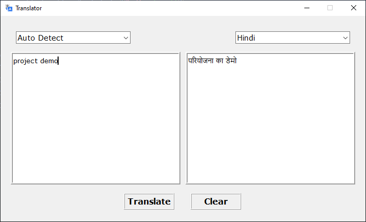

# Translator-GUI [](https://forthebadge.com)

[](https://github.com/insanecodes/Translator-GUI)
[](https://github.com/insanecodes/Translator-GUI/fork)
<br>
A Translator App Made Using Python 3.9.0 .
Hope You Will Like It and you can also use the code to make your own version.

It is an attempt to make an interactive Instant Translator, supporting multiple languages,built using tkinter and googletrans modules in python.


>### To Run, simply double click on the **translator.exe**.
## Requirements
1. googletrans 3.1.0a0
2.  tkinter

---

### Installing The pip install googletrans Module:
* For Linux: Open Terminal then type ```pip install googletrans==3.1.0a0```
* For Windows: Open CMD, then type ```pip install googletrans==3.1.0a0```

---
## Demo


<div align="center">

### Show some ❤️ by starring the repository!

</div>
